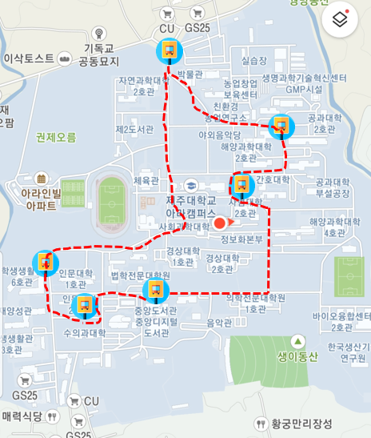

# BusStop-Maping

<h2>Jeju-university bus stop visualization project</h2>

<h3>commit member </h3>
<li>Younwoo Roh!</li>
<li>Gayeong Kim!</li>
<h3>used API</h4>
<li>google Map API</li>

<h3>Project preview</h3>

