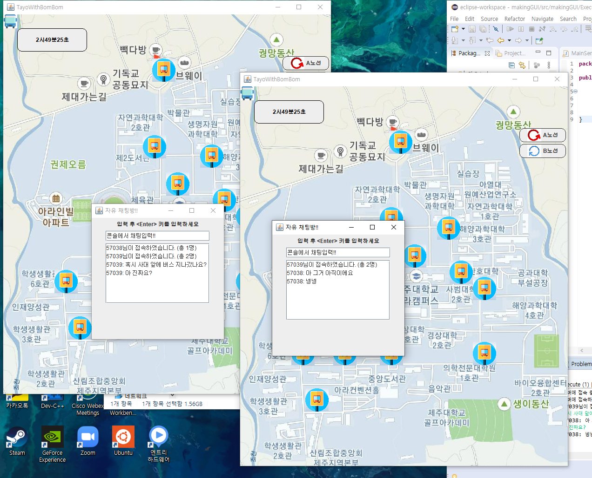

# BusStop-Maping

<h2>Jeju-university bus stop visualization project</h2>

<h3>commit member </h3>
<li>Younwoo Roh</li>
<li>Gayeong Kim</li>
<h3>used package</h4>
<li>java.awt</li>
<li>java.swing</li>
<li>java.io</li>
<li>java.net</li>

<h3>How to Execute</h3>
<li>execute MainServer</li>
<li>execute Execute as a client</li>

<h3>Project preview</h3>

